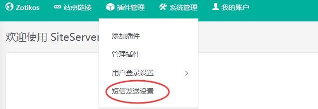
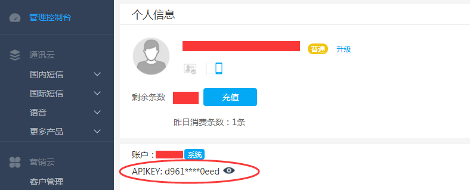
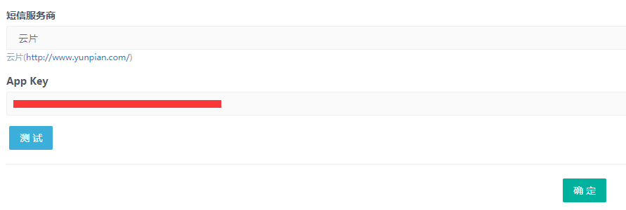
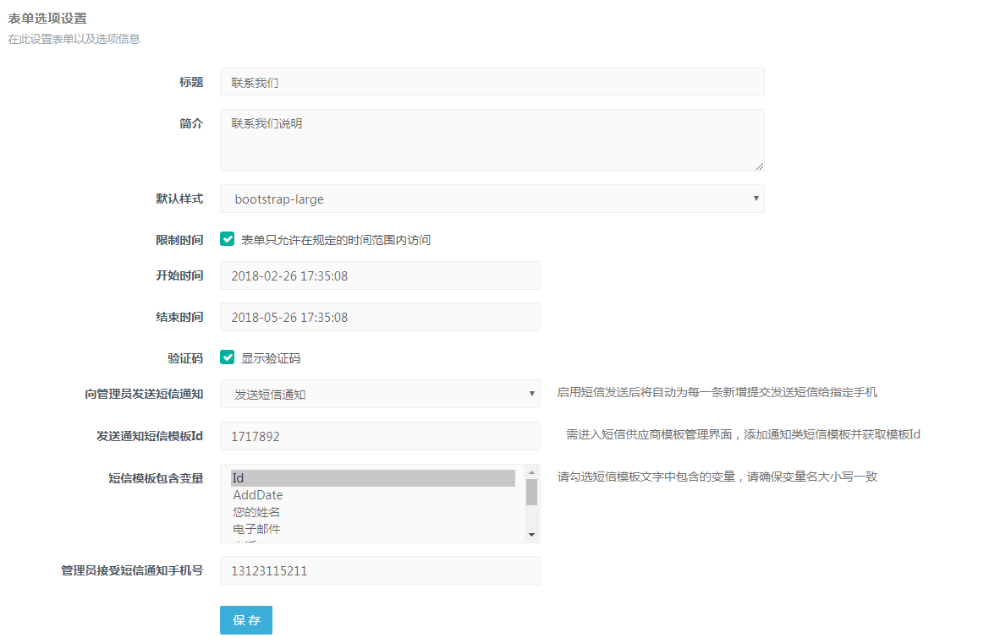

# SiteServer CMS 短信插件(SS.SMS)

接入第三方云片短信接口，用于发送短信验证码。

## 短信接口配置

* 短信插件安装成功后再插件管理下拉菜单可以看到短信发送设置，点击进行短信接口配置



* 填写APP Key；这里需要注册短信服务商云片账号（[注册云片账号](https://www.yunpian.com/entry) ）

* 登录云片账号查看APIKEY



* 将云片的APIKEY 填写到 后台 App Key 中



* 提交表单管理中选择向管理员发送短信通知，然后设置发送通知短信模板Id，选择短信模板和包含变量，填写管理员接受短信通知手机号，至此短信发送设置成功，前台页面提交表单提交成功后就会给设置好的手机号发送短信。





## 插件调用SS.SMS包

开发插件时可以引用并调用 SS.SMS 短信插件接口发送短信，方法如下：

### SS.SMS包安装

请在包管理器控制台中运行以下命令：
```
PM> Install-Package SS.SMS
```

### API 调用

```c#
var smsPlugin = PluginApi.GetPlugin<SmsPlugin>(SmsPlugin.PluginId);
if (smsPlugin != null && smsPlugin.IsReady)
{
    string errorMessage;
    var code = 123456;
    smsPlugin.SendCode(mobile, code, tplId, out errorMessage);
}
```